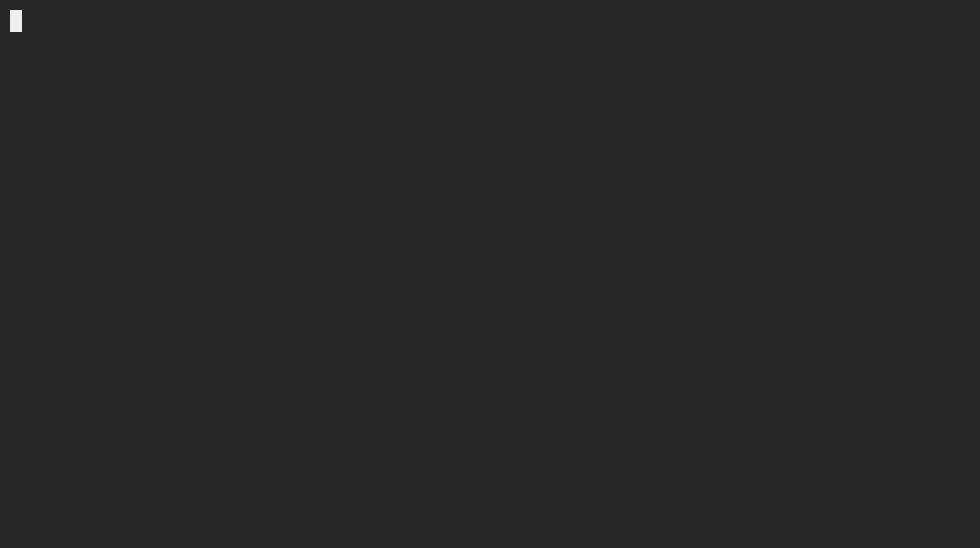
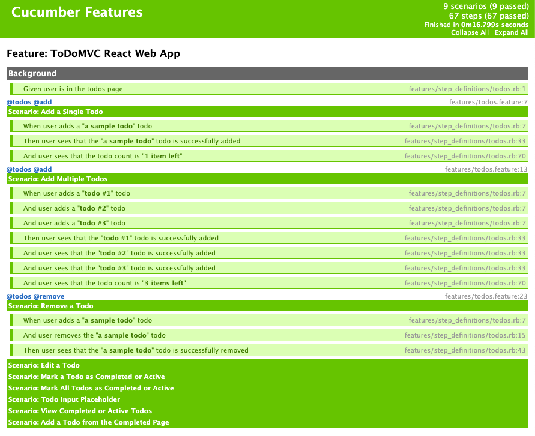

# ToDoMVC React Automated Checks using Ruby and Watir

## Running Watir UI Tests

---

### Dependencies

* [Ruby and the Ruby Development Kit](https://www.ruby-lang.org/en/downloads/)
* [Bundler](https://bundler.io/). Run `gem install bundler`.

---

### Headlessly

1. Open a web browser. Go to the remote code repository (<https://github.com/jasonogayon/autochecks-rb-watir>) and copy its SSH or HTTPS link.

2. On your machine, open a terminal and clone the remote repository locally wherever you want. Run `git clone git@github.com:jasonogayon/autochecks-rb-watir.git`.

3. After that, go inside the cloned **autochecks-rb-watir** repository. You can decide to rename this directory to what you want.

4. Now we can try to run our tests locally on our machine. They will of course fail first because we have not yet installed our code dependencies. Run `make h`.

5. So install the dependencies. Run `bundle install`.

6. After that, we can try to run our tests again and see if they proceed. Run `make h` again.

---

### With Browser Launching

1. Follow the same steps 1-5 above.

2. Run `make ui`

---

### Reports

Running the tests in whatever mode generates a test report in HTML format, found inside the **report** directory. If a test fails, a screenshot will be generated inside the **screenshots** directory for the test.

---

Author: Jason B. Ogayon \
Software Engineer and Software Tester
